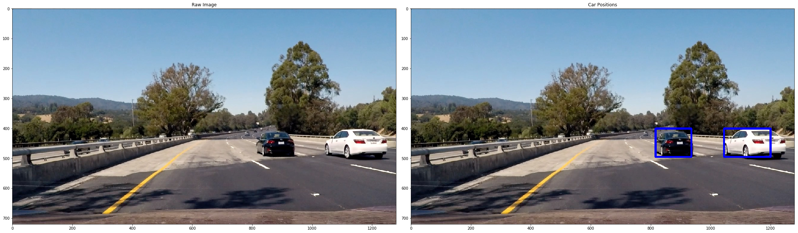

# Person Re-identification

## What is it and how does this work?
The goal of the project is to write a pipeline to identify vehicles in a video from a front-facing camera on a car. 
Data for this tasks are in 'dataset' folder (drawn from the [KITTI dataset](http://www.cvlibs.net/datasets/kitti/raw_data.php?type=road)).

